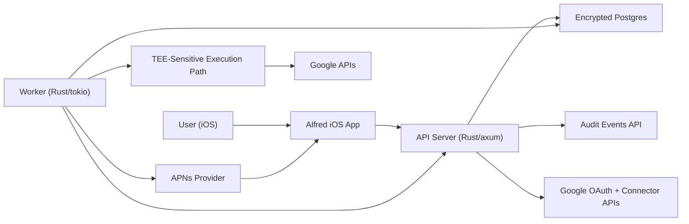

# Alfred

Alfred is a hosted, privacy-first AI life assistant focused on proactive help, not chat.

In Phase I, Alfred helps users by:

1. Sending meeting reminders from Google Calendar.
2. Sending a daily morning brief.
3. Sending urgent Gmail alerts.
4. Answering natural-language assistant questions using connected Google context.

## What This Project Is

Alfred is designed around a simple product thesis:

1. Hosted convenience should not require weak privacy guarantees.
2. Proactive automation must be reliable before it is broad.
3. Users should always keep control (auditability, revoke, delete-all).

This repository contains the iOS app, backend services, API contract, and security/privacy design docs needed to ship that product.

## Architecture Overview

At a high level, Alfred has eight core parts:

1. iOS app (`SwiftUI`) for sign-in, settings, and notification UX.
2. Rust API server (`axum`) for auth, connector, preferences, audit, and privacy APIs.
3. LLM orchestration layer for assistant query and proactive summaries.
4. OpenRouter provider gateway for model routing/fallback.
5. Rust worker (`tokio`) for scheduled/proactive processing.
6. Encrypted Postgres for operational state.
7. TEE-backed path for sensitive decrypt + provider fetch work.
8. APNs delivery pipeline for user notifications.



## Privacy Model

Alfred is intentionally opinionated about privacy:

1. Least privilege by default:
   Minimal OAuth scopes and no silent scope broadening.
2. Token protection:
   Connector secrets are encrypted at rest, with sensitive decrypt paths guarded by attestation and policy.
3. Data minimization:
   Alfred stores only what is required for reminders/alerts, retries, and auditability.
4. User control:
   Users can revoke connectors and request delete-all.
5. Auditability:
   Access/actions are logged as redacted audit events.

## How Alfred Delivers Value (Phase I)

1. User signs in and connects Google.
2. Alfred assembles normalized calendar/email context for assistant capabilities.
3. API/worker call LLM workflows (via OpenRouter) to generate summaries/prioritized actions.
4. APNs delivers timely notifications to iOS.
5. User can inspect activity and revoke/delete at any time.

## Repository Map

1. iOS app: `alfred`
2. iOS API package: `alfred/Packages/AlfredAPIClient`
3. Backend workspace: `backend`
4. API contract: `api/openapi.yaml`
5. DB migrations: `db/migrations`
6. Product context: `docs/product-context.md`
7. RFC: `docs/rfc-0001-alfred-ios-v1.md`
8. Threat model: `docs/threat-model-phase1.md`

## Quick Start

Run from repository root:

```bash
just check-tools
just backend-check
just ios-build
```

If you need local database-backed backend work:

```bash
just check-infra-tools
just infra-up
just backend-migrate
```

## For Contributors

Use these docs as the source of truth:

1. Product intent and scope: [docs/product-context.md](docs/product-context.md)
2. Contributor and agent workflow: [agent/start.md](agent/start.md)
3. Security/scalability requirements: [docs/engineering-standards.md](docs/engineering-standards.md)
4. API contract: [api/openapi.yaml](api/openapi.yaml)
5. Cloud deploy + local manual testing guide: [docs/cloud-deployment-local-testing.md](docs/cloud-deployment-local-testing.md)

Implementation work is issue-driven and prioritized by Phase I labels in GitHub (`phase-1`, then `P0` before `P1`).
