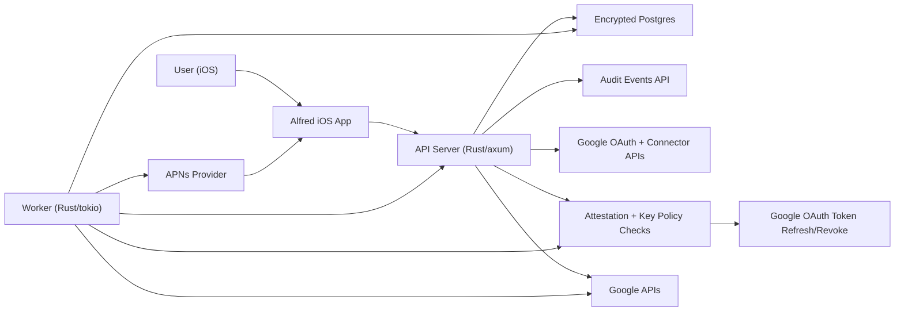

# Alfred

Alfred is a hosted, privacy-first AI life assistant focused on proactive help, not chat.

In Phase I, Alfred helps users by:

1. Sending meeting reminders from Google Calendar.
2. Sending a daily morning brief.
3. Sending urgent Gmail alerts.
4. Answering natural-language assistant questions using connected Google context.

## What This Project Is

Alfred is designed around a simple product thesis:

1. Hosted convenience should not require weak privacy guarantees.
2. Proactive automation must be reliable before it is broad.
3. Users should always keep control (auditability, revoke, delete-all).

This repository contains the iOS app, backend services, API contract, and security/privacy design docs needed to ship that product.

## Implementation Status (As Of 2026-02-16)

Implemented now:

1. Clerk-authenticated API surface for connectors, preferences, audit events, and privacy delete-all.
2. LLM-first backend paths for:
   1. `/v1/assistant/attested-key` + encrypted `/v1/assistant/query` (meetings-today capability)
   2. Worker morning brief generation
   3. Worker urgent-email prioritization
3. OpenRouter model routing/fallback plus reliability guardrails (rate limits, circuit breaker, cache, budget controls).
4. Worker lease/retry/idempotency engine with dead-letter handling.
5. Encrypted-at-rest storage for connector tokens and APNs device tokens.

Still in progress:

1. External security assessment and remediation program before beta (`#43`).
2. Remaining Phase I product/ops readiness items on the board (`docs/phase1-master-todo.md`).

## Architecture Overview

At a high level, Alfred has eight core parts:

1. iOS app (`SwiftUI`) for sign-in, settings, and notification UX.
2. Rust API server (`axum`) for auth, connector, preferences, audit, and privacy APIs.
3. LLM orchestration layer for assistant query and proactive summaries.
4. OpenRouter provider gateway for model routing/fallback.
5. Rust worker (`tokio`) for scheduled/proactive processing.
6. Encrypted Postgres for operational state.
7. Attestation-gated sensitive token path with enclave runtime + KMS-bound policy enforcement.
8. APNs delivery pipeline for user notifications.



## Privacy Model

Alfred is intentionally opinionated about privacy:

1. Least privilege by default:
   Minimal OAuth scopes and no silent scope broadening.
2. Token protection:
   Connector secrets are encrypted at rest, with sensitive decrypt authorization guarded by attestation and key policy checks.
   Enclave runtime + RPC boundary controls are implemented; external assessment/remediation remains in progress.
3. Data minimization:
   Alfred stores only what is required for reminders/alerts, retries, and auditability.
4. User control:
   Users can revoke connectors and request delete-all.
5. Auditability:
   Access/actions are logged as redacted audit events.

## How Alfred Delivers Value (Phase I)

1. User signs in and connects Google.
2. Alfred assembles normalized calendar/email context for assistant capabilities.
3. API/worker call LLM workflows (via OpenRouter) to generate summaries/prioritized actions.
4. APNs delivers timely notifications to iOS.
5. User can inspect activity and revoke/delete at any time.

## Repository Map

1. iOS app: `alfred`
2. iOS API package: `alfred/Packages/AlfredAPIClient`
3. Backend workspace: `backend`
4. API contract: `api/openapi.yaml`
5. DB migrations: `db/migrations`
6. Product context: `docs/product-context.md`
7. RFC: `docs/rfc-0001-alfred-ios-v1.md`
8. Threat model: `docs/threat-model-phase1.md`
9. Security + TEE execution tracker (completed): [GitHub issue #130](https://github.com/niteshbalusu11/alfred/issues/130)

## Local Backend Quick Start

Run from repository root (`alfred/`).

1. Validate tools:

```bash
just check-tools
just check-infra-tools
```

2. Create local env file:

```bash
cp .env.example .env
```

Assistant note:
`ASSISTANT_INGRESS_*` defaults in `.env.example` are set for local development so encrypted assistant queries can run end-to-end without extra setup.

3. Start local infra and apply DB migrations:

```bash
just infra-up
just backend-migrate
```

4. Start services in separate terminals:

Terminal A:

```bash
just enclave-runtime
```

Terminal B:

```bash
just api
```

Terminal C:

```bash
just worker
```

5. Verify health:

```bash
curl -s http://127.0.0.1:8080/healthz
curl -s http://127.0.0.1:8080/readyz
curl -s http://127.0.0.1:8181/healthz
```

Expected API responses include `{\"ok\":true}`.

6. Stop local infra when done:

```bash
just infra-stop
```

If you want to wipe local DB volumes too:

```bash
just infra-down
```

## Quick Build/Check

Run from repository root:

```bash
just check-tools
just backend-check
just ios-build
```

If you need local database-backed backend work:

```bash
just check-infra-tools
just infra-up
just backend-migrate
```

## For Contributors

Use these docs as the source of truth:

1. Product intent and scope: [docs/product-context.md](docs/product-context.md)
2. Contributor and agent workflow: [agent/start.md](agent/start.md)
3. Security/scalability requirements: [docs/engineering-standards.md](docs/engineering-standards.md)
4. API contract: [api/openapi.yaml](api/openapi.yaml)
5. Cloud deploy + local manual testing guide: [docs/cloud-deployment-local-testing.md](docs/cloud-deployment-local-testing.md)

Implementation work is issue-driven and prioritized by Phase I labels in GitHub (`phase-1`, then `P0` before `P1`).
