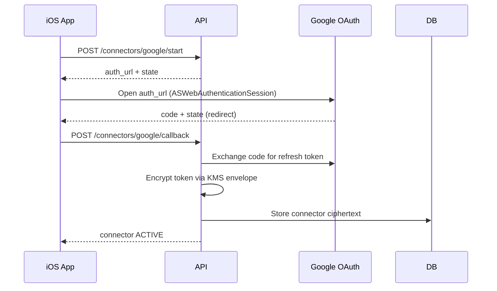
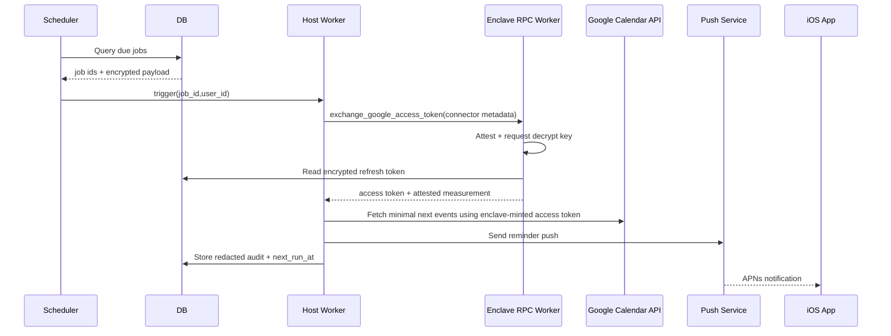
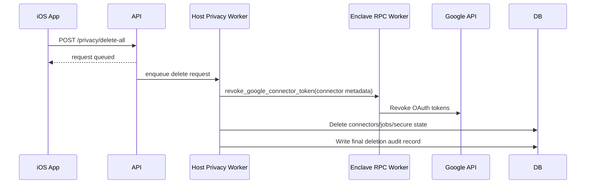

# RFC-0001: Alfred iOS v1 (Hosted, Privacy-First)

- Status: Draft
- Owner: Alfred Team
- Last Updated: 2026-02-14

## 1. Summary

Build Alfred v1 as an iOS-first personal assistant with three capabilities:

1. Meeting reminders from Google Calendar.
2. Daily morning brief.
3. Urgent email alerts from Gmail.

This RFC defines iOS app behavior, backend API contracts, security constraints, data schemas, and core execution flows.

## 2. Goals

1. Launch an iOS app with reliable proactive reminders and alerts.
2. Keep user trust by minimizing stored data and enforcing strict privacy controls.
3. Use hosted infrastructure while reducing plaintext exposure via confidential compute.

## 3. Non-Goals (v1)

1. Smart home integrations (Ring, Hue, Nest, HomeKit action control).
2. Fully autonomous external actions (sending emails without confirmation).
3. Multi-platform clients (Android/web).
4. Voice-first assistant experience.

## 4. Product Scope

### 4.1 User Stories

1. As a user, I connect Google once and receive reminders before meetings.
2. As a user, I get a short morning summary at a chosen time.
3. As a user, I get urgent email alerts without storing my full inbox in Alfred.
4. As a user, I can revoke Google access and delete Alfred data instantly.

### 4.2 Functional Requirements

1. Google OAuth connect/revoke.
2. Push notifications via APNs.
3. Per-user reminder preferences.
4. Audit trail of Alfred access/actions.
5. “Delete my data” workflow completed within SLA.

## 5. iOS App Architecture

### 5.1 Tech Stack

1. Swift + SwiftUI.
2. `ASWebAuthenticationSession` for Google OAuth.
3. `URLSession` for API requests.
4. Keychain for auth/session token storage.
5. APNs for push receipt.

### 5.2 iOS Modules

1. `AuthModule`: sign-in/session refresh/logout.
2. `ConnectorModule`: Google connect, scope display, revoke.
3. `SettingsModule`: reminder lead time, quiet hours, risk controls.
4. `AuditModule`: user-visible redacted activity logs.
5. `NotificationsModule`: register token, category handling, deep links.

### 5.3 Local Storage Rules

1. Allowed local persistence:
   1. App session token (Keychain).
   2. APNs device token.
   3. UI preferences and feature flags.
2. Not allowed local persistence:
   1. Full Gmail contents.
   2. Full Calendar event payloads.

## 6. Backend Architecture (Required for iOS v1)

1. API Gateway + Auth service.
2. OAuth Connector service (Google only in v1).
3. Scheduler (EventBridge or Temporal).
4. Confidential Worker pool (TEE-backed).
5. Encrypted Postgres.
6. Notification delivery service (APNs provider).
7. Audit service.

## 7. API Contract (v1)

All endpoints require bearer auth unless noted.

### 7.1 Auth

`POST /v1/auth/ios/session`

Request:

```json
{
  "apple_identity_token": "base64-jwt",
  "device_id": "ios-device-uuid"
}
```

Response:

```json
{
  "access_token": "jwt",
  "refresh_token": "opaque",
  "expires_in": 3600
}
```

### 7.2 Push Registration

`POST /v1/devices/apns`

Request:

```json
{
  "device_id": "ios-device-uuid",
  "apns_token": "hex-token",
  "environment": "sandbox"
}
```

Response:

```json
{
  "ok": true
}
```

### 7.3 Google Connect

`POST /v1/connectors/google/start`

Request:

```json
{
  "redirect_uri": "alfred://oauth/google/callback"
}
```

Response:

```json
{
  "auth_url": "https://accounts.google.com/o/oauth2/v2/auth?...",
  "state": "csrf-token"
}
```

`POST /v1/connectors/google/callback`

Request:

```json
{
  "code": "oauth-code",
  "state": "csrf-token"
}
```

Response:

```json
{
  "connector_id": "con_123",
  "status": "ACTIVE",
  "granted_scopes": [
    "gmail.readonly",
    "calendar.readonly"
  ]
}
```

`DELETE /v1/connectors/:connector_id`

Response:

```json
{
  "status": "REVOKED"
}
```

### 7.4 Preferences

`GET /v1/preferences`

Response:

```json
{
  "meeting_reminder_minutes": 15,
  "morning_brief_local_time": "08:00",
  "quiet_hours_start": "22:00",
  "quiet_hours_end": "07:00",
  "high_risk_requires_confirm": true
}
```

`PUT /v1/preferences`

Request:

```json
{
  "meeting_reminder_minutes": 10,
  "morning_brief_local_time": "07:30",
  "quiet_hours_start": "23:00",
  "quiet_hours_end": "06:30",
  "high_risk_requires_confirm": true
}
```

Response:

```json
{
  "ok": true
}
```

### 7.5 Audit + Privacy

`GET /v1/audit-events?cursor=...`

Response:

```json
{
  "items": [
    {
      "id": "ae_1",
      "timestamp": "2026-02-14T16:24:10Z",
      "event_type": "CONNECTOR_FETCH",
      "connector": "google",
      "result": "SUCCESS",
      "metadata": {
        "source": "calendar"
      }
    }
  ],
  "next_cursor": "..."
}
```

`POST /v1/privacy/delete-all`

Response:

```json
{
  "request_id": "del_123",
  "status": "QUEUED"
}
```

## 8. Data Schemas

### 8.1 Server DB Tables

`users`

```sql
id UUID PRIMARY KEY,
created_at TIMESTAMPTZ NOT NULL,
status TEXT NOT NULL
```

`devices`

```sql
id UUID PRIMARY KEY,
user_id UUID NOT NULL,
apns_token_ciphertext BYTEA NOT NULL,
environment TEXT NOT NULL,
created_at TIMESTAMPTZ NOT NULL,
updated_at TIMESTAMPTZ NOT NULL
```

`connectors`

```sql
id UUID PRIMARY KEY,
user_id UUID NOT NULL,
provider TEXT NOT NULL,
scopes TEXT[] NOT NULL,
refresh_token_ciphertext BYTEA NOT NULL,
token_key_id TEXT NOT NULL,
token_version INT NOT NULL DEFAULT 1,
token_rotated_at TIMESTAMPTZ NOT NULL,
status TEXT NOT NULL,
created_at TIMESTAMPTZ NOT NULL,
revoked_at TIMESTAMPTZ NULL
```

`jobs`

```sql
id UUID PRIMARY KEY,
user_id UUID NOT NULL,
type TEXT NOT NULL,
due_at TIMESTAMPTZ NOT NULL,
state TEXT NOT NULL,
payload_ciphertext BYTEA NULL,
last_run_at TIMESTAMPTZ NULL,
next_run_at TIMESTAMPTZ NULL
```

`audit_events`

```sql
id UUID PRIMARY KEY,
user_id UUID NOT NULL,
event_type TEXT NOT NULL,
connector TEXT NULL,
result TEXT NOT NULL,
redacted_metadata JSONB NOT NULL,
created_at TIMESTAMPTZ NOT NULL
```

### 8.2 Data Minimization Rules

1. Store refresh tokens encrypted only.
2. Never store full email body in DB.
3. Never store raw calendar feed long-term.
4. Persist only minimal state needed for retries/scheduling.

## 9. Core Flows

### 9.1 Google Connect Flow



### 9.2 Meeting Reminder Flow



### 9.3 Delete-All Privacy Flow



## 10. Threat Model (v1)

1. Token theft from DB.
2. Insider access to user data.
3. Over-collection from Google APIs.
4. Prompt injection via malicious email content.

Mitigations:

1. TEE-gated enclave RPC for decrypt/token-refresh/token-revoke + KMS attestation.
2. Strict RBAC + break-glass logging.
3. Fetch windows/scopes minimized.
4. Safe-action policy: external actions require user confirmation in v1.

### 10.1 Trust Boundaries

1. Boundary A: API/worker host runtimes are untrusted for connector-token plaintext and cannot directly invoke decrypt repository APIs.
2. Boundary B: Attested enclave identity is trusted for decrypt operations only when measurement is allow-listed and attestation evidence is signed + fresh.
3. Boundary C: KMS key policy binds decrypt capability to enclave measurement and key metadata (`token_key_id`, `token_version`).
4. Boundary D: Google token refresh/revoke calls are issued only by enclave RPC handlers after successful decrypt authorization.

### 10.2 Decrypt Authorization Rules

1. Connector decrypt is denied when attestation runtime does not match expected TEE runtime.
2. Connector decrypt is denied when enclave measurement is not in allow-list.
3. Connector decrypt is denied when attestation signature is invalid or attestation timestamp is outside allowed freshness window.
4. Connector decrypt is denied when persisted connector key metadata does not match active KMS key policy.
5. Connector decrypt is permitted only after all four checks pass.

## 11. Observability

1. Metrics:
   1. Reminder delivery success rate.
   2. P95 reminder latency.
   3. OAuth token refresh failure rate.
   4. False positive urgent-email rate.
2. Logs:
   1. Redacted only.
   2. No raw email/event payloads.

## 12. SLOs and SLAs

1. Reminder delivery: 99.5% within 60 seconds of scheduled time.
2. API availability: 99.9% monthly.
3. Privacy delete request completion: <= 24 hours.

## 13. Rollout Plan

1. Internal dogfood (team accounts only).
2. Private beta (50 users).
3. Expanded beta (200 users, paid pilot).
4. GA after SLO stability for 30 days.

## 14. Open Questions

1. Urgent email logic in v1: rules-only vs LLM-assisted?
2. Timezone conflict behavior when calendar timezone differs from device timezone.
3. Minimum retention period for redacted audit logs.
4. Whether to support Google push notifications (Pub/Sub) in v1 or after beta.
